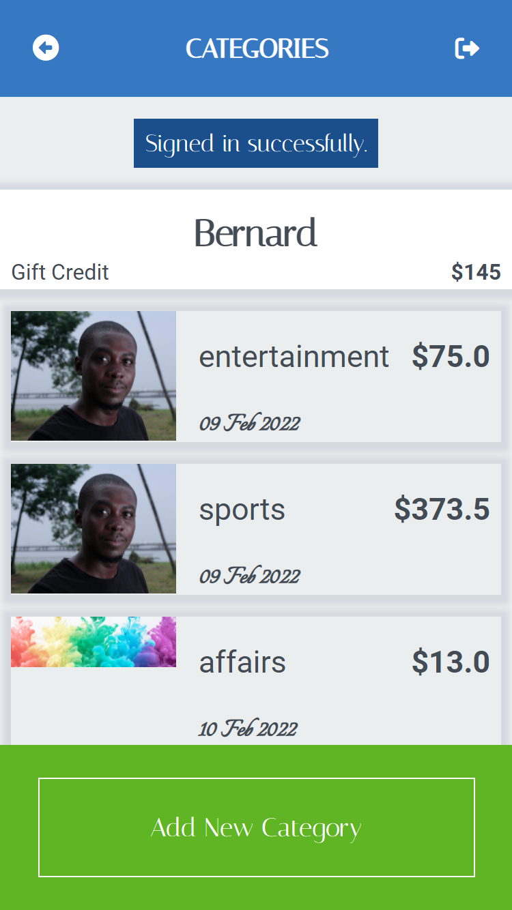
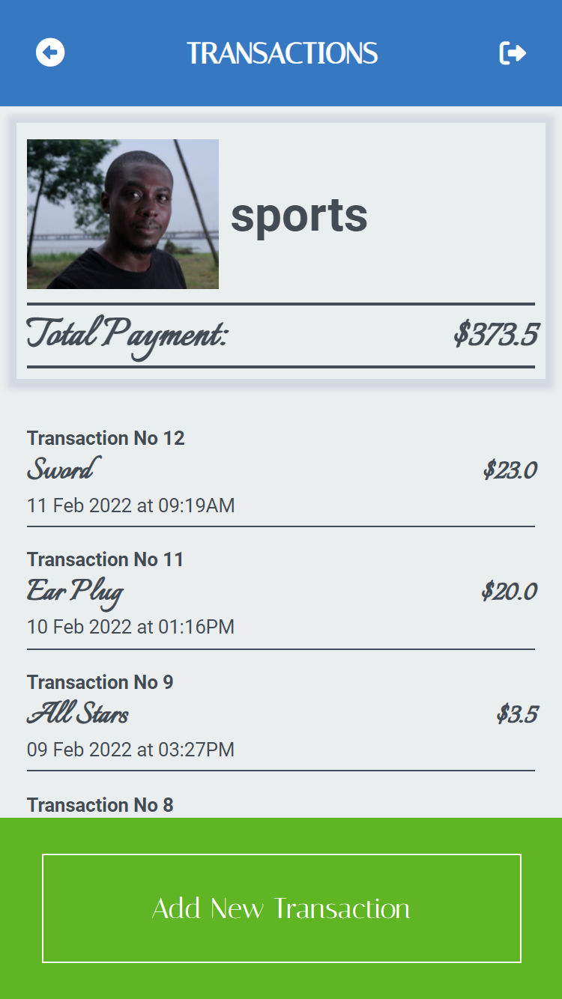
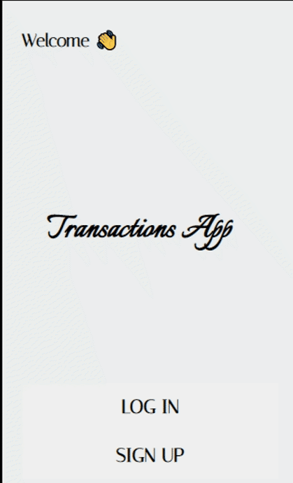
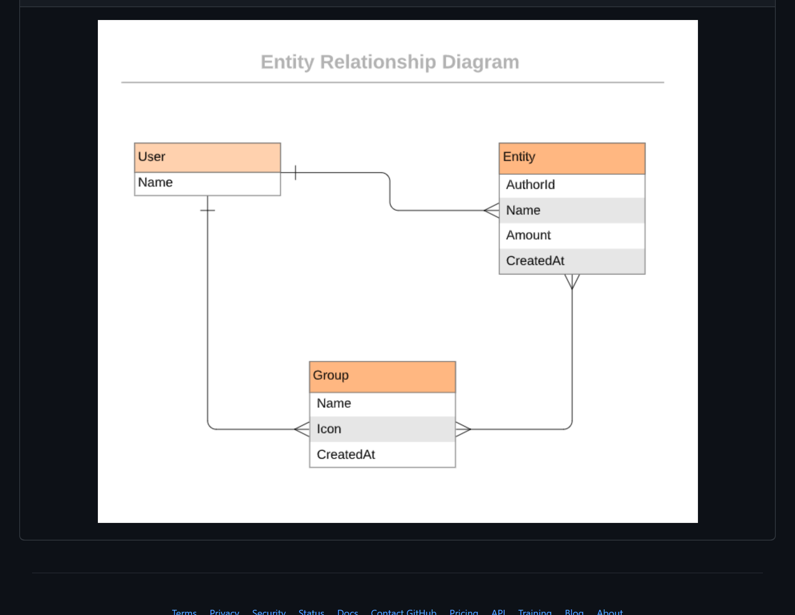

# BudgetApp

> The BudgetApp is a Microverse Ruby on Rails capstone project that is about building a mobile web application where you can manage your budget: you have a list of transactions associated with a category/many categories, so that you can see how much money you spent and on what item you spent it on
---

## Screenshot
> |Categories Page| Records Page   |
> |---------------|----------------|
> |||

## Brief Demo

> 

## ERD Diagram for Models

> |ERD DIAGRAM|
> |-----------|
> ||

## Project Requirements
- Click [HERE](https://github.com/microverseinc/curriculum-rails/blob/main/capstone/rails_capstone.md) for details of project requirements 


## Built With

- Ruby
- Ruby on Rails
- RSpec
- CapyBara
- Devise
- Cancancan

## Getting Started

To get a local copy up and running follow these simple example steps.

```
git clone https://github.com/Gambit142/Budget-App.git
```

and then run

```
bundle install
```

## Development

start of by creating the database and running migrations using
`bin/rails db:setup`

to start the server run `bin/rails s`

## Testing
to test simply run `rspec spec`


## Authors
👤 **Francis Ugorji**

- GitHub: [@Gambit142](https://github.com/MrBrN197)
- LinkedIn: [LinkedIn](https://www.linkedin.com/in/francis-ugorji/)


## 🤝 Contributing

Contributions, issues, and feature requests are welcome!

Feel free to check the [issues page](../../issues/).

## Show your support

Give a ⭐️ if you like this project!

## Acknowledgments
- Hat tip to [Microverse](https://www.microverse.org/) for the opprotunity to learn Ruby and Ruby on Rails using their platform
- Original design idea by [Gregoire Vella on Behance](https://www.behance.net/gregoirevella)